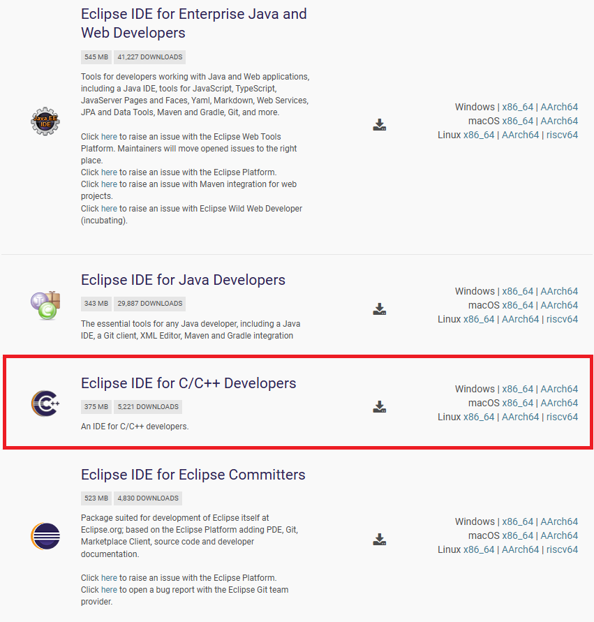
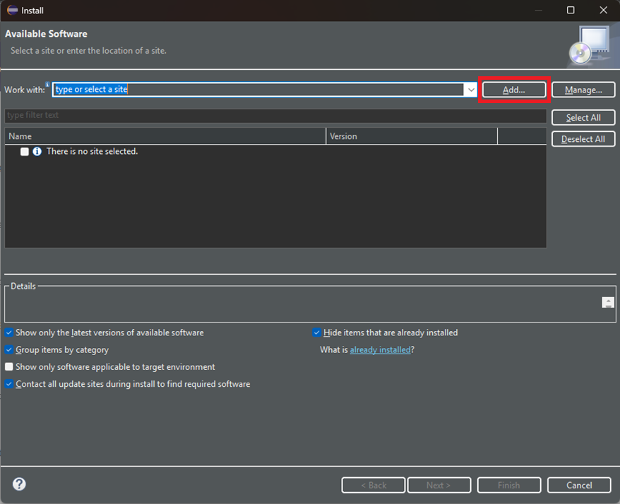
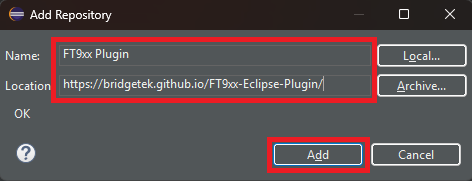
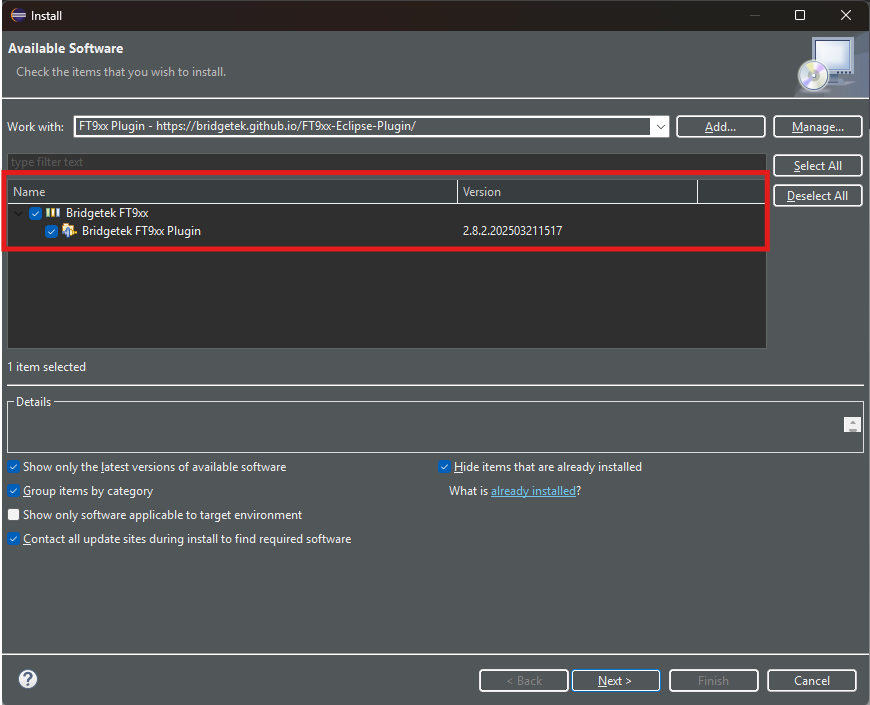
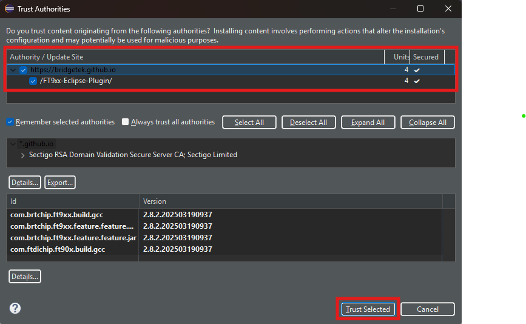

# FT9xx Plugin for Eclipse

The FT9xx Plugin for Eclipse is designed to streamline embedded development for FT9xx-based projects. This plugin enhances the Eclipse IDE with features that simplify project creation, configuration, and debugging, enabling a seamless development experience.

## Key Features

- **Template Project Creation** – Quickly set up new FT9xx projects with pre-configured settings, reducing setup time.
- **Example Project Import** – Easily browse and import sample projects to kickstart development.
- **Build & Debug Configuration** – Simplifies toolchain setup, ensuring smooth compilation and debugging.
- **Third-Party & Layered Library Integration** – Effortlessly include external libraries, middleware, and hardware abstraction layers.

By providing these capabilities, the FT9xx Plugin for Eclipse empowers developers to focus on firmware development without the hassle of manual project setup and configuration.

## Installing Eclipse and the FT9xx Plugin Manually

When running the installer, you can choose not to install Eclipse as part of the installation. This might be useful if you already have Eclipse installed for other purposes. This section details how to set up Eclipse for use with the FT9xx.

### Eclipse Installation

1. Go to the [Eclipse website](https://www.eclipse.org/) and download the **“Eclipse IDE for C/C++ Developers”** package. At the time of writing, Eclipse Mars is the latest release and is the recommended version.
   
2. When you run Eclipse for the first time, it will ask for the workspace location.

   A workspace is a directory on your hard drive where Eclipse stores the projects defined for it. More specifically, a workspace is a logical collection of projects. When you specify this directory name to Eclipse, it will create some files within this directory to manage the projects. The projects controlled by this workspace may or may not reside in this directory. Specify a directory name and click **OK**.

   **Note:** To run Eclipse, you must download and install the Java Runtime Environment (JRE) or Java Development Kit (JDK). Eclipse will display a warning if this is not installed. Oracle provides these tools for free.

### FT9xx Eclipse Plugin Installation

To complete the configuration of Eclipse for FT9xx development, an additional plugin is provided as part of the download. Follow these steps to install the plugin:

1. From the Eclipse toolbar, select **“Help => Install New Software ...”**. This will open the window shown below:
    
2. Click the **Add** button, and the following window will appear:
    - **Name:** FT9xx Plugin
    - **Location:** <https://bridgetek.github.io/FT9xx-Eclipse-Plugin/>
    - 
3. Click the **Add** button to add the repository. After scanning the repository, the package selection screen will appear. Check the box for **Bridgetek FT9xx Plugin**, then click **Next** to install the plugin.
    - 
4. Eclipse will request you to trust the authorities. Confirm this step.
    - 
5. The plugin will install and prompt you to restart Eclipse. Once restarted, the FT9xx Plugin installation is complete.
